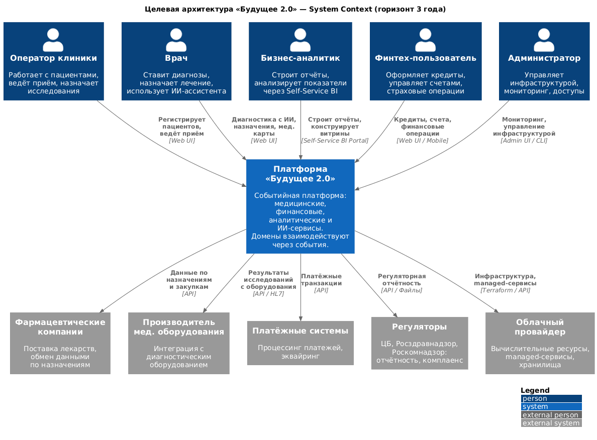
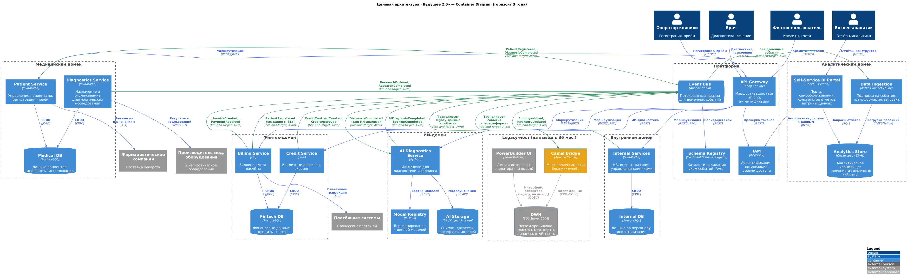
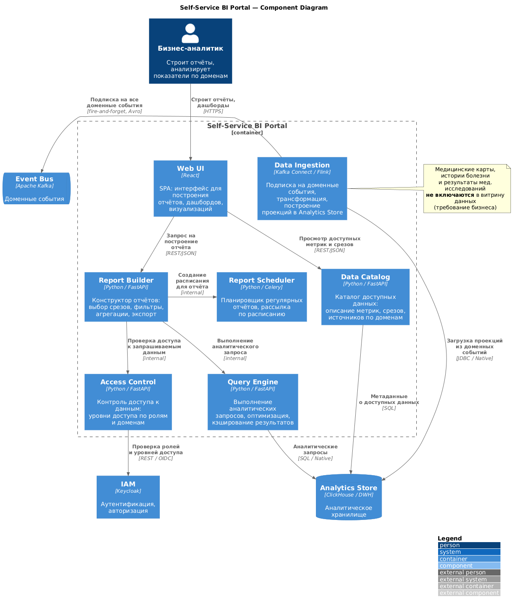
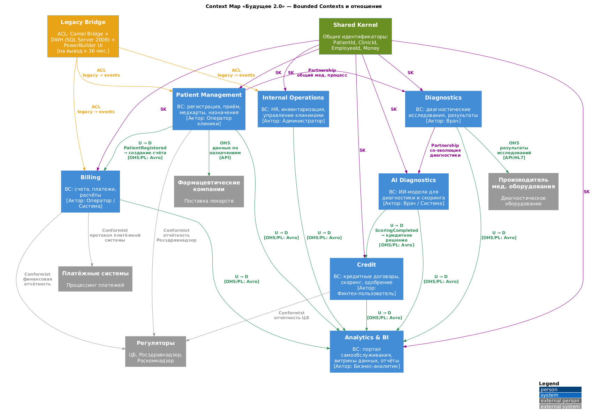
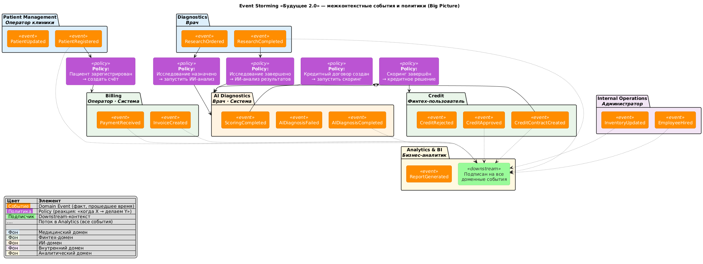
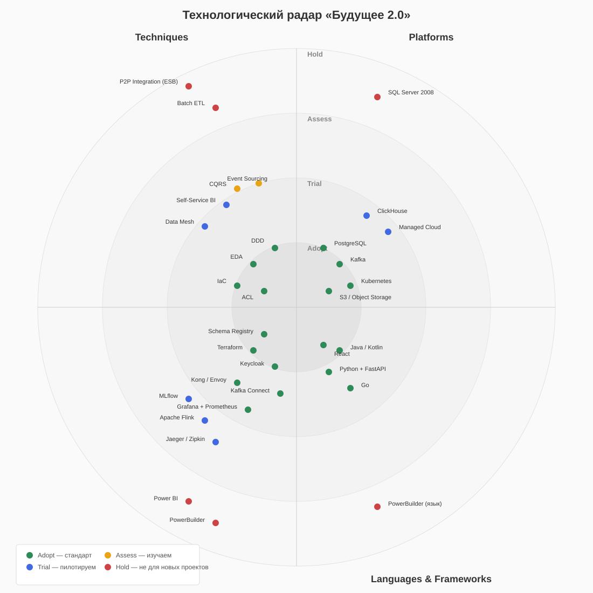
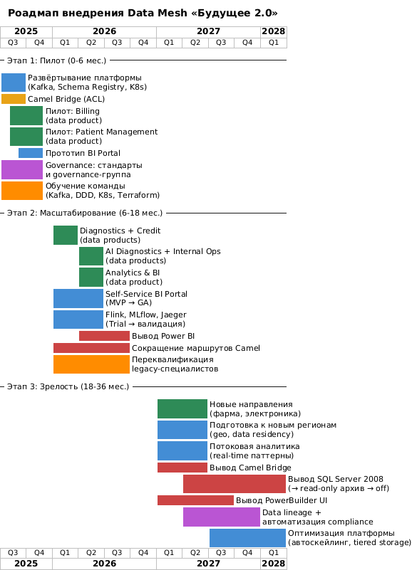

# architecture-future_2_0

Проектная работа 11 спринта курса «Архитектор Про» (Яндекс.Практикум).

**Спринт 11:** Построение архитектуры данных, технологические тренды и миграция в облака.

**Кейс:** компания «Будущее 2.0» — медицинский бизнес с купленным банком, планами интеграции фармкомпаний и производителя электроники. Легаси-стек (SQL Server 2008, PowerBuilder, Apache Camel ESB), сотни терабайт данных, необходимость миграции в облако и перехода на событийную архитектуру.

---

## Общий контекст

### Компания «Будущее 2.0»

Четыре подразделения: головной офис, клиники, ИИ-компания (медицинская диагностика), финтех с банковской лицензией.

**Текущий стек:**
- DWH на Microsoft SQL Server 2008 (сотни ТБ, значительная часть бизнес-логики в хранимых процедурах)
- PowerBuilder (клиентский интерфейс оператора)
- ESB на Apache Camel (интеграционный слой)
- ИИ-сервисы на Python
- Финтех-сервисы на Go и Java
- Power BI (отчётность)

**Проблемы:** медленная отчётность (часы), монолитный DWH как bottleneck, сложность интеграции новых бизнес-направлений, устаревшее оборудование.

### Цели бизнеса

**Промежуточное (пара месяцев):** архитектурное решение сформировано, границы доменов определены, проекты по витрине данных запланированы.

**Финальное (год):** реализован портал самообслуживания, бизнес-пользователи работают с данными в новой архитектуре, допускается сохранение legacy.

**Долгосрочное (три года):** масштабирование (продукты, география, данные), слабосвязанная событийная платформа, домены через события и реактивные потоки, Camel и DWH — только мосты совместимости на этапе миграции.

### Этапы трансформации

1. **0–6 мес.:** пилот в 1–2 доменах, единые принципы событий, DLQ, каталог схем
2. **6–18 мес.:** расширение на критические домены, потоковые витрины, ACL для Camel и DWH
3. **18–36 мес.:** отказ от синхронных интеграций на критическом пути, доменная аналитика на потоках

### Две ключевые задачи от руководства

1. **Витрина данных** — портал самообслуживания, масштабируемый независимо от количества бизнес-направлений. Медицинские карты, истории болезни и результаты исследований **не включаются**.
2. **Архитектурное решение** — изменение IT-ландшафта для интеграции новых направлений без необходимости вносить бизнес-логику в DWH.

---

## Задания

| Задание | Директория | Описание | Статус |
|---------|-----------|----------|--------|
| Task 3 | [`Task3Advanced/`](Task3Advanced/) | Целевая C4-архитектура + карта рисков | **Готово** |
| Task 4 | [`Task4Advanced/`](Task4Advanced/) | DDD, bounded contexts, Event Storming, обоснование | **Готово** |
| Task 5 | [`Task5Advanced/`](Task5Advanced/) | Техрадар, TCO-анализ, роадмап Data Mesh | **Готово** |
| Task 1 | [`Task1Advanced/`](Task1Advanced/) | Модульная инфраструктура Terraform (dev/stage/prod) | Не начато |
| Task 2 | [`Task2Advanced/`](Task2Advanced/) | CI/CD + удалённое хранение состояния (S3/Minio) | Не начато |

**Порядок выполнения:** 3 → 4 → 5 → 1 → 2 (сначала архитектура и домены, потом инфраструктура).

---

## Task3Advanced — Проектирование целевой архитектуры и оценка рисков

### Что сделано

1. C4-диаграммы целевой архитектуры (PlantUML, горизонт 3 года)
2. Карта рисков трансформации (12 рисков, 4 категории)
3. План управления рисками (меры снижения для каждого риска)

### C4-диаграммы

| Файл | Описание |
|------|----------|
| [`c4-context.puml`](Task3Advanced/c4-context.puml) | C4 Level 1 — System Context |
| [`c4-container.puml`](Task3Advanced/c4-container.puml) | C4 Level 2 — Container Diagram |
| [`c4-component-bi-portal.puml`](Task3Advanced/c4-component-bi-portal.puml) | C4 Level 3 — Component Diagram (Self-Service BI Portal) |

### C4 Level 1 — System Context

Целевое состояние платформы «Будущее 2.0» через 3 года.

**Персоны:** оператор клиники, врач, бизнес-аналитик, финтех-пользователь, администратор.

**Внешние системы:** фармацевтические компании, производитель мед. оборудования, платёжные системы, регуляторы (ЦБ, Росздравнадзор, Роскомнадзор), облачный провайдер.

### C4 Level 2 — Container Diagram

Основная диаграмма. Слабосвязанная событийная платформа. Домены взаимодействуют через Event Bus (Kafka), внутри доменов — синхронные вызовы (REST/gRPC).

**Домены:**
- **Медицинский** — Patient Service, Diagnostics Service, Medical DB
- **Финтех** — Billing Service, Credit Service, Fintech DB
- **ИИ** — AI Diagnostics Service, Model Registry, AI Storage
- **Внутренний** — Internal Services (HR, инвентаризация, управление клиниками), Internal DB
- **Аналитический** — Self-Service BI Portal, Data Ingestion, Analytics Store

**Платформа:** Event Bus (Kafka), Schema Registry, API Gateway (Kong/Envoy), IAM (Keycloak).

**Legacy-мост (на вывод к 36 мес.):** DWH (SQL Server 2008), Camel Bridge (ACL), PowerBuilder UI.

**Визуальные конвенции:**
- Серый — legacy-компоненты (на вывод)
- Синий — новые компоненты целевой архитектуры
- Оранжевый — мосты совместимости (ACL)

### C4 Level 3 — Component Diagram (Self-Service BI Portal)

Декомпозиция ключевого бизнес-требования — портала самообслуживания.

**Компоненты:**
- **Web UI** (React) — SPA для построения отчётов и дашбордов
- **Report Builder** (Python/FastAPI) — конструктор отчётов: срезы, фильтры, агрегации
- **Query Engine** (Python/FastAPI) — выполнение аналитических запросов, кэширование
- **Data Catalog** (Python/FastAPI) — каталог доступных метрик и срезов по доменам
- **Access Control** (Python/FastAPI) — контроль доступа по ролям и доменам
- **Data Ingestion** (Kafka Connect/Flink) — подписка на доменные события, трансформация, загрузка проекций
- **Report Scheduler** (Python/Celery) — планировщик регулярных отчётов

> **Важно:** медицинские карты, истории болезни и результаты мед. исследований **не включаются** в витрину данных (требование бизнеса).

### Карта рисков

Подробности — в [`risk-map.md`](Task3Advanced/risk-map.md), план управления — в [`risk-management-plan.md`](Task3Advanced/risk-management-plan.md).

| ID | Риск | Категория | Вер-ть | Влияние | Уровень |
|----|------|-----------|--------|---------|---------|
| R1 | Неверная декомпозиция на домены | Архитектурный | Средняя | Высокое | Высокий |
| R2 | Eventual consistency не принята бизнесом | Архитектурный | Средняя | Среднее | Средний |
| R3 | Vendor lock-in | Архитектурный | Средняя | Среднее | Средний |
| R4 | ACL / Camel Bridge — bottleneck | Архитектурный | Высокая | Высокое | **Критический** |
| R5 | Потеря данных при миграции DWH | Технологический | Средняя | Высокое | Высокий |
| R6 | Производительность Event Bus | Технологический | Низкая | Высокое | Средний |
| R7 | Безопасность при миграции | Технологический | Средняя | Высокое | Высокий |
| R8 | Нехватка компетенций | Организационный | Высокая | Среднее | Высокий |
| R9 | Сопротивление изменениям | Организационный | Высокая | Среднее | Высокий |
| R10 | Двойная нагрузка на команду | Организационный | Высокая | Среднее | Высокий |
| R11 | Регуляторные нарушения | Бизнес | Низкая | Высокое | Средний |
| R12 | Превышение бюджета и сроков | Бизнес | Средняя | Высокое | Высокий |

Для каждого риска в плане управления описаны: триггеры, стратегия (избежание / снижение / передача / принятие), конкретные меры с разделением на технические и управленческие.

### Архитектурные решения и осознанные упрощения (Task3)

**Ключевые принципы:**
- Домены автономны: у каждого своя БД, свои сервисы
- Межсоменное взаимодействие — только через события (fire-and-forget, Avro)
- Внутри домена — синхронные вызовы (REST/gRPC)
- Event Bus (Kafka) + Schema Registry — центральная инфраструктура
- API Gateway — единая точка входа для внешних клиентов

**Осознанные упрощения:**
1. Внутренние сервисы (HR, инвентаризация, управление клиниками) объединены во «Внутренний домен». В реальном проекте каждый мог бы стать отдельным bounded context.
2. Фармацевтические компании и производитель электроники показаны как внешние системы (System_Ext) на Context-диаграмме. Детализация их интеграции — за рамками текущего задания, направления на этапе планирования.
3. Медицинские карты, истории болезни и результаты исследований явно исключены из витрины данных — в соответствии с требованием бизнеса.

---

## Task4Advanced — Моделирование домена и интеграций

### Что сделано

1. Context Map — схема Bounded Contexts и отношений между ними (PlantUML)
2. Event Storming — Big Picture диаграмма межконтекстных событий и политик (PlantUML)
3. Описание агрегатов — границы, инварианты, ключи для каждого BC
4. Каталог доменных событий — 15 событий с контрактами и подписчиками
5. Обоснование событийного подхода vs Camel/DWH

### Артефакты

| Файл | Описание |
|------|----------|
| [`bounded-contexts.puml`](Task4Advanced/bounded-contexts.puml) | Context Map — Bounded Contexts и отношения |
| [`event-storming.puml`](Task4Advanced/event-storming.puml) | Event Storming — Big Picture (межконтекстные события и политики) |
| [`aggregates.md`](Task4Advanced/aggregates.md) | Описание агрегатов (границы, инварианты, ключи) |
| [`events.md`](Task4Advanced/events.md) | Каталог доменных событий (контракты, подписчики) |
| [`justification.md`](Task4Advanced/justification.md) | Обоснование событийного подхода vs Camel/DWH |

### Context Map — Bounded Contexts

7 Bounded Contexts, выделенных по принципам DDD:

| Домен | Bounded Context | Ключевые агрегаты |
|-------|----------------|------------------|
| Медицинский | Patient Management | Patient |
| Медицинский | Diagnostics | DiagnosticOrder |
| Финтех | Billing | Invoice, Payment |
| Финтех | Credit | CreditContract |
| ИИ | AI Diagnostics | AIAnalysis, ScoringModel |
| Внутренний | Internal Operations | Employee, InventoryItem |
| Аналитический | Analytics & BI | Report |

**Типы отношений между контекстами:**

| Цвет на диаграмме | Тип отношения | Описание |
|-------------------|---------------|----------|
| Фиолетовый | Partnership | Равноправная со-эволюция (Patient Mgmt ↔ Diagnostics, Diagnostics ↔ AI) |
| Зелёный | Customer–Supplier (U→D) | Upstream публикует события, downstream подписан [OHS/PL: Avro] |
| Серый | Conformist | Downstream принимает модель upstream as-is (регуляторы, платёжные системы) |
| Оранжевый | ACL | Anti-Corruption Layer — трансляция legacy → events (Legacy Bridge) |

**Shared Kernel:** общие идентификаторы (PatientId, ClinicId, EmployeeId, Money), используемые всеми BC.

### Event Storming — Big Picture

Межконтекстные события и политики — как домены связаны через события.

**5 межконтекстных политик (ключевые интеграции):**

| # | Событие-триггер | Политика | Целевой BC |
|---|----------------|----------|------------|
| 1 | PatientRegistered | → Создать счёт за первичный приём | Billing |
| 2 | ResearchOrdered | → Запустить ИИ-анализ | AI Diagnostics |
| 3 | ResearchCompleted | → ИИ-анализ результатов исследований | AI Diagnostics |
| 4 | CreditContractCreated | → Запустить скоринг | AI Diagnostics |
| 5 | ScoringCompleted | → Принять кредитное решение | Credit |

Все доменные события поступают в **Analytics & BI** (downstream) для обновления аналитических проекций.

### Агрегаты

10 агрегатов в 7 BC. Для каждого описаны: корень, ID, внутренние объекты, инварианты, публикуемые события. Подробности — в [`aggregates.md`](Task4Advanced/aggregates.md).

**Ключевые принципы:**
- Ссылки между агрегатами — только по ID (не прямые ссылки)
- Один агрегат — одна транзакция
- Согласованность между агрегатами — через события (eventual consistency)

### Каталог событий

15 доменных событий. Для каждого описаны: источник, агрегат, семантика, подписчики, минимальный контракт (payload). Подробности — в [`events.md`](Task4Advanced/events.md).

**Сводная таблица:**

| # | Событие | Источник | Подписчики |
|---|---------|----------|------------|
| 1 | PatientRegistered | Patient Management | Billing, Analytics |
| 2 | PatientUpdated | Patient Management | Analytics |
| 3 | ResearchOrdered | Diagnostics | AI Diagnostics, Analytics |
| 4 | ResearchCompleted | Diagnostics | AI Diagnostics, Analytics |
| 5 | AIDiagnosisCompleted | AI Diagnostics | Analytics |
| 6 | AIDiagnosisFailed | AI Diagnostics | Analytics |
| 7 | ScoringCompleted | AI Diagnostics | Credit, Analytics |
| 8 | InvoiceCreated | Billing | Analytics |
| 9 | PaymentReceived | Billing | Analytics |
| 10 | CreditContractCreated | Credit | AI Diagnostics, Analytics |
| 11 | CreditApproved | Credit | Analytics |
| 12 | CreditRejected | Credit | Analytics |
| 13 | EmployeeHired | Internal Operations | Analytics |
| 14 | InventoryUpdated | Internal Operations | Analytics |
| 15 | ReportGenerated | Analytics & BI | — (внутреннее) |

Все события передаются через Event Bus (Kafka) в формате **Avro**, версионируются через **Schema Registry**. Стандартный конверт включает `correlationId` для сквозной трассировки цепочек.

### Обоснование событийного подхода

Подробности — в [`justification.md`](Task4Advanced/justification.md).

**Кратко:** текущая архитектура (Camel + DWH) создаёт тесную связность, batch-отчётность с задержкой в часы и невозможность добавления новых направлений без модификации центрального хранилища. Событийный подход решает все три проблемы: слабая связность (fire-and-forget), near-real-time (секунды вместо часов), масштабируемость (новый BC = подписка на топики, без изменения существующих доменов).

---

## Task5Advanced — Проектирование технологического стека и расчёт стоимости

### Что сделано

1. Расширенный технологический радар (технологии + архитектурные паттерны, 4 квадранта × 4 кольца)
2. TCO-анализ текущей vs целевой архитектуры на горизонте 3 лет
3. Стратегический роадмап внедрения Data Mesh (3 этапа, 6 ролей, 8 milestones)

### Артефакты

| Файл | Описание |
|------|----------|
| [`tech-radar.md`](Task5Advanced/tech-radar.md) | Расширенный технологический радар (таблица с обоснованиями) |
| [`tech-radar.svg`](Task5Advanced/tech-radar.svg) | Визуализация техрадара (SVG, 4 квадранта × 4 кольца) |
| [`tco-analysis.md`](Task5Advanced/tco-analysis.md) | TCO-анализ (текущая vs целевая архитектура, 3 года) |
| [`roadmap.md`](Task5Advanced/roadmap.md) | Стратегический роадмап внедрения Data Mesh |
| [`roadmap.puml`](Task5Advanced/roadmap.puml) | Gantt-диаграмма роадмапа (PlantUML) |

### Технологический радар

Расширенный радар включает технологии и архитектурные паттерны. 4 квадранта (Techniques, Platforms, Tools, Languages & Frameworks) × 4 кольца (Adopt, Trial, Assess, Hold).

**Сводка по кольцам:**

| Кольцо | Techniques | Platforms | Tools | Languages & Frameworks |
|--------|-----------|-----------|-------|----------------------|
| **Adopt** | EDA, DDD, IaC, ACL | Kafka, PostgreSQL, K8s, S3 | Terraform, Keycloak, Kong/Envoy, Schema Registry, Kafka Connect, Grafana+Prometheus | Java/Kotlin, Python+FastAPI, Go, React |
| **Trial** | Data Mesh, Self-Service BI | ClickHouse, Managed Cloud | Flink, MLflow, Jaeger/Zipkin | — |
| **Assess** | CQRS, Event Sourcing | — | — | — |
| **Hold** | Batch ETL, P2P Integration | SQL Server 2008 | Power BI, PowerBuilder | PowerBuilder |

**Ключевые решения:**
- **EDA, DDD, IaC — Adopt.** Фундамент целевой архитектуры, проверен в Task3–4.
- **Data Mesh, Self-Service BI — Trial.** Внедряются поэтапно, начиная с пилота. Переход в Adopt после валидации.
- **CQRS, Event Sourcing — Assess.** Потенциально полезны (финтех, audit trail), но требуют отдельного PoC.
- **SQL Server 2008, PowerBuilder, Power BI, Batch ETL, P2P Integration — Hold.** Весь текущий стек — на вывод с планом замены.

### TCO-анализ

Сравнение совокупной стоимости владения на горизонте 3 лет. Единица измерения: 1 у.е. = стоимость одного инженера в год (FTE).

**Сравнение по годам:**

| Год | As-Is | To-Be | Разница |
|-----|-------|-------|---------|
| Год 1 | 18.0 | 29.0 | +11.0 (инвестиция) |
| Год 2 | 19.4 | 22.0 | +2.6 (инвестиция) |
| Год 3 | 21.0 | 16.0 | −5.0 (экономия) |
| **Итого** | **58.4** | **67.0** | **+8.6** |

**Ключевые выводы:**
- На горизонте 3 лет целевая архитектура дороже на ~15% — плата за миграцию и параллельную работу двух миров.
- **Точка окупаемости — 4-й год (~42 мес.).** После этого экономия 5–8 у.е./год с нарастающим эффектом.
- Основной драйвер затрат — **персонал** (50%+ от TCO). В as-is дорожает (дефицит legacy-специалистов), в to-be — стабилизируется.
- Основной драйвер экономии — **устранение неэффективности** (10.5 → 3.5 у.е. за 3 года, экономия 7.0).
- **Неденежные факторы** усиливают аргумент: security-риск SQL Server 2008 (end-of-life), time-to-market, масштабируемость, привлечение кадров.
- **Рекомендация:** трансформация экономически обоснована, особенно с учётом нарастающих рисков as-is.

Подробности: допущения, разбивка по статьям затрат, sensitivity analysis — в [`tco-analysis.md`](Task5Advanced/tco-analysis.md).

### Роадмап внедрения Data Mesh

Три этапа, синхронизированные с общими этапами трансформации и TCO-анализом.

**Этапы:**

| Этап | Период | Цель | Ключевые результаты |
|------|--------|------|-------------------|
| **1. Пилот** | 0–6 мес. | Валидация подхода на 1–2 доменах | Billing и Patient Management публикуют data products, прототип BI Portal, governance-стандарты, Camel Bridge (ACL), обучение команды |
| **2. Масштабирование** | 6–18 мес. | Все домены в Data Mesh, запуск BI Portal | Все 7 BC публикуют data products, Self-Service BI Portal (GA), вывод Power BI, сокращение Camel, переквалификация legacy-специалистов |
| **3. Зрелость** | 18–36 мес. | Полный переход, новые направления | Подключение фармы и электроники, вывод legacy (SQL Server, PowerBuilder, Camel), потоковая аналитика, подготовка к новым регионам |

**Ключевые роли:**

| Роль | Описание |
|------|----------|
| Data Product Owner | Владелец data product домена: состав, SLA, бэклог, governance. На старте 2 (пилот), к Этапу 3 — в каждом домене. |
| Data Engineer (доменный) | Строит пайплайны публикации data product внутри домена. |
| Platform Data Engineer | Развивает Self-Serve Data Platform (Kafka, ClickHouse, Data Catalog). |
| BI-аналитик | Потребитель data products: отчёты и дашборды в Self-Service BI Portal. |
| Governance Lead | Координация стандартов, эскалация конфликтов между доменами. |
| Security Champion | Аудит безопасности, compliance (ФЗ-152, ЦБ), data residency. |

**Контрольные точки (milestones):** 8 go/no-go точек от месяца 3 до месяца 36. Подробности — в [`roadmap.md`](Task5Advanced/roadmap.md).

### Связь артефактов Task5

Три артефакта — три проекции одного решения:
- **Tech Radar** отвечает на вопрос **«что»**: какие технологии и паттерны используем (Adopt), пробуем (Trial), от чего отказываемся (Hold).
- **TCO** отвечает на вопрос **«сколько»**: стоимость текущего и целевого состояния, точка окупаемости, обоснование инвестиции.
- **Роадмап** отвечает на вопрос **«когда»**: этапы внедрения, роли, milestones, привязка к бизнес-целям.

---

## Task1Advanced — Модульная инфраструктура Terraform

*Будет заполнено.*

**Ожидаемые артефакты:**
- `modules/vm/` — переиспользуемый модуль vm_module (main.tf, variables.tf, outputs.tf)
- `envs/dev/`, `envs/stage/`, `envs/prod/` — конфигурации окружений (.tfvars)
- README.md модуля

---

## Task2Advanced — CI/CD и удалённое хранение состояния

*Будет заполнено.*

**Ожидаемые артефакты:**
- Terraform-код с S3-совместимым backend
- CI/CD pipeline (GitHub Actions / GitLab CI / Jenkins): init → plan → apply
- README.md с описанием скриптов

---

## Инструменты

- **Диаграммы:** PlantUML с C4-PlantUML (`!include` из [plantuml-stdlib/C4-PlantUML](https://github.com/plantuml-stdlib/C4-PlantUML))
- **Рендеринг:** [planttext.com](https://www.planttext.com/)
- **IaC:** Terraform
- **Репозиторий:** GitHub (публичный)
